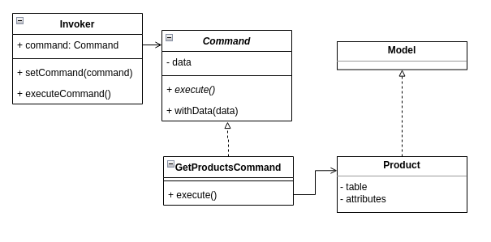

# Command Pattern

Este pattern deve ser utilizado quando é necessário criar uma camada
entre uma Interface e o servidor, criando classes responsáveis por
gerenciar os requests para o servidor.
Existem três entidades nesse padrão, sendo elas, a classe Invoker responsável
por passar o request para o Command responsável pela ação; a classe Command que
é responsável por formatar a requisição e chamar o Receiver correspondente;
e a class Receiver que finalmente executa a ação desejada recebendo os dados
do Command.

O diagrama abaixo representa as classes do arquivo CommandAPIExample.php



Exemplo de uso:
```bash
sudo docker-compose up -d --build
sudo docker ps
sudo docker exec -it designpatterns_php_1 sh
php Command/sqlite.php
php commandAPIExample.php
```