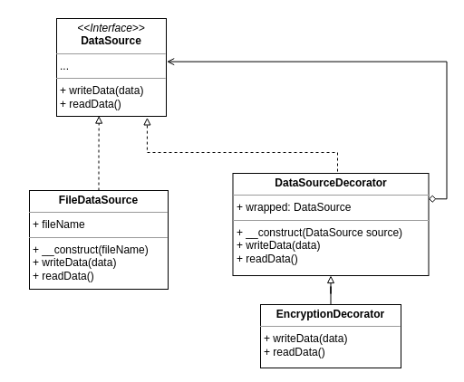

# Decorator Pattern

Esse padrão entrega uma forma organizada de criar classes específicas a partir
de uma classe principal
Exemplo: Em um cenário onde precisamos criar uma classe para escrever e ler conteúdos
de um arquivo, podemos utilizar essa padrão aplicando os seguintes passos:
1. Criamos uma interace padrão com funções para ler e escrever dados
2. Criamos uma classe específica para trabalhar com arquivos implementando a interface
3. Criamos uma classe Decorator para trabalhar com classes que implementam a interface
de arquivo
4. O Decorator também extende a interface de arquivos
5. Criamos um Decorator específico para criptografar os dados antes de serem salvos
em arquivos. Esse Decorator utiliza a classe específica de escrita em arquivos para
salvar os dados e recupera-lós, porém ela implementa passos intermediários onde
os dados são criptografados antes de serem salvos, e são descriptografados antes de
serem retornados na leitura



Exemplo de uso do script: php decorator.php file.txt 'batman begins'

```bash
php decorator.php [arg1] [arg2]
```

```php
$fileSource = new FileDataSource($argv[1]);
$wrapper = new EncryptionDecorator($fileSource);
echo $wrapper->writeData($argv[2])."\n";
echo $wrapper->readData()."\n";
```