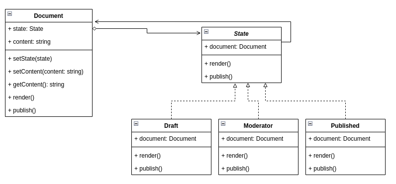

# State

This pattern is used when is desired to control an object behavior through some desired state. To implement this pattern the context class should use an state object from a common interface and delegate its request to the state object.

